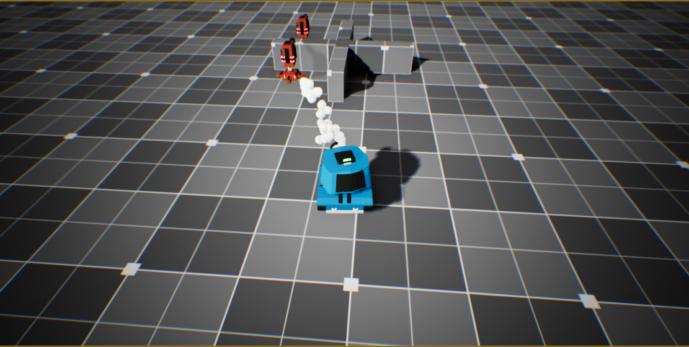

# ToonTanks

* ToonTanks is 3rd person shooting game where you control the Blue tank.

* The goal of this game is to shoot and destroy the enemy  tarrouts. 

* The Game is making use of C++ classes as well as blueprints.

* Creating simple AI system able to detect the player location

* This is a one of the four games of the Unreal4 engine course on Udemy
 
 

